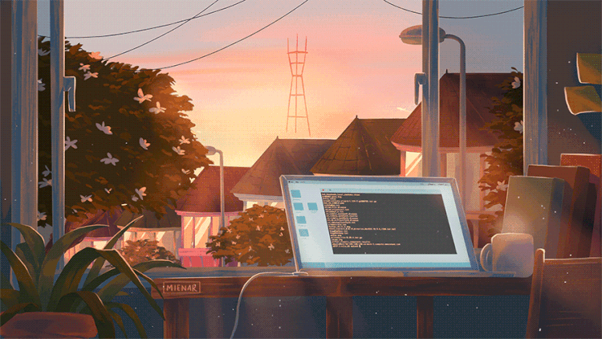
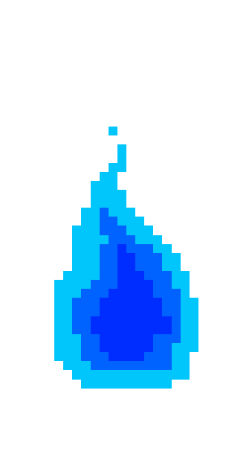

---   
<!--titulo--> 

<table width="100%" align="center">
<td align="center">
 
 
 

<ul align="Left">

<h1 style="display: inline-block">Hello World 🌎</h1>

###
  
<!--Imagem-->
  

  

###

<!-- Apresentaçao -->

  - 💻 Estudante de Analise e Desenvolvimento de Sistemas, focado em sempre aprender e se tornar um desenvolvedor de software.

  

  - 👨‍💻 Em busca de conhecimento constante.

 
</a>

</td>
</tr>
</table>

<!--Estatiticas-->

  
  

###

   <h1>Skills 
   </h1>

  
  
  
  
  
  
  
  
  

###

        

